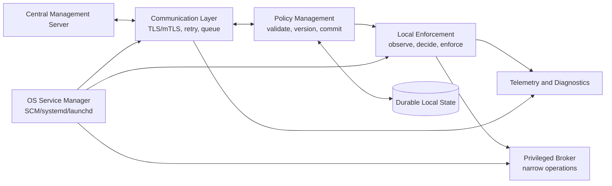
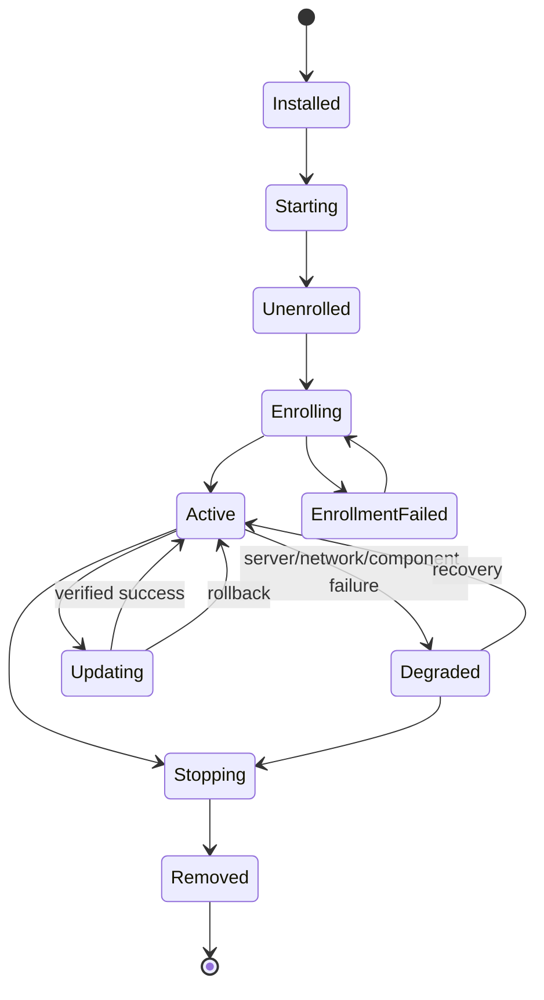

# Category 1 — Endpoint Agent Architecture and Lifecycle

Interview preparation for a **Software Engineer with ~3 years of experience**.

These questions test whether you can build a long-running, security-sensitive component that remains correct when the machine reboots, the network disappears, the process crashes, the policy changes halfway through an update, or an attacker tries to abuse its privileges.

## The core mental model

An endpoint agent is not simply “a program that polls a server.” It is a **locally supervised control plane and enforcement process** with a remote management relationship.

The central design rule is:

> **The agent must remain safe and useful when the server, network, or any non-critical component is unavailable.**

From that rule, the architecture follows:

- The OS owns **process supervision** and automatic startup.
- A local component owns **enforcement** and should not depend on a live network request for every decision.
- A communication component owns **transport**, retry, authentication, and backpressure.
- A policy component owns **versioned, validated, atomic policy state**.
- Privileged code is minimized and isolated behind a narrow **IPC/RPC boundary**.
- Every state-changing operation is **durable**, **idempotent**, and recoverable after restart.

## Reference architecture



A production implementation may combine some boxes, but the **responsibilities and trust boundaries** should remain explicit.

---

## Fundamentals and architecture

### 1. What is an endpoint agent? How is it different from a traditional desktop application or backend service?

An **endpoint agent** is software installed on an individual device that runs continuously, usually as a **Windows Service**, **Linux daemon**, or **macOS LaunchDaemon/LaunchAgent**. It communicates with a central management system and performs local work such as policy enforcement, inventory, monitoring, telemetry collection, updates, or device management.

The important characteristics are **persistent**, **headless**, **locally autonomous**, **security-sensitive**, and **remotely managed**.

| Endpoint agent | Desktop application | Backend service |
|---|---|---|
| Runs on an end-user or managed device | Runs in a user's interactive session | Runs in a data center or cloud environment |
| Usually has no UI | Usually owns UI and user interaction | Usually exposes APIs or consumes queues |
| Must survive reboot, logout, and network loss | Often stops when the user exits or logs out | Usually managed by a server/orchestrator |
| Performs local observation/enforcement | Performs interactive user workflows | Coordinates shared business logic and data |
| Uses OS service/daemon supervision | Uses desktop launch mechanisms | Uses containers, VMs, schedulers, or service managers |
| Must minimize privilege on an untrusted endpoint | Runs with the user's permissions in many cases | Runs under server-side identity and network policy |

An endpoint agent is different from a backend service because it runs in an environment that is **physically accessible to the user**, has intermittent connectivity, has heterogeneous OS versions, and may be under attack. It is different from a desktop app because its lifecycle must not depend on a logged-in user or graphical session.

**Keywords interviewers want to hear:** **headless**, **long-running**, **OS-supervised**, **local enforcement**, **remote management**, **offline operation**, **least privilege**, **security boundary**.

### 2. Design a cross-platform endpoint agent that communicates with a central management server

Start with a **shared platform-independent core** and thin OS-specific adapters.

#### Shared core

- **Agent lifecycle and state machine**: installed, unenrolled, enrolling, active, degraded, updating, stopping, and removed.
- **Policy engine**: validates, versions, compiles, and evaluates policy.
- **Enforcement engine**: observes local state and applies allowed actions.
- **Transport client**: maintains authenticated communication, retries with backoff, and handles server commands.
- **Durable store**: persists identity metadata, policy snapshots, cursors, pending operations, and telemetry.
- **Update manager**: verifies, stages, activates, and rolls back agent packages.
- **Diagnostics**: health status, metrics, logs, support bundle, and crash information.

#### OS-specific adapters

- **Service lifecycle**: SCM on Windows, systemd on Linux, launchd/ServiceManagement on macOS.
- **Secure credential store**: Windows DPAPI/Credential Manager, Linux-provided secret strategy or protected files, and macOS Keychain.
- **Filesystem, process, networking, and device APIs**.
- **Privilege boundary**: Windows service account and named-pipe/RPC security, Unix UID/GID and capabilities, macOS XPC and entitlements.
- **Installer and updater integration**.

#### Communication design

Use an authenticated, versioned protocol over **TLS**, preferably **mutual TLS (mTLS)** after enrollment. The protocol should support:

- server-to-agent commands;
- agent-to-server telemetry and acknowledgements;
- policy version and capability negotiation;
- request IDs for **idempotency**;
- bounded message sizes and validation;
- durable outbound queues for temporary disconnects;
- exponential backoff with **jitter**;
- cancellation and deadlines.

The agent should never block its core enforcement loop on a network call. Network work belongs in an asynchronous communication component with explicit **backpressure**.

**Good interview answer:**

> “I would build a shared core for state, policy, transport, and persistence, and isolate OS-specific lifecycle, secure storage, and enforcement adapters behind interfaces. The agent would use mTLS, durable queues, versioned messages, bounded retries, and cached last-known-good policy so network loss does not stop local protection.”

### 3. How would you separate the local enforcement layer, communication layer, and policy management layer?

Separate them by **responsibility**, **failure behavior**, and **trust boundary**.

#### Local enforcement layer

Responsible for:

- observing local system state;
- evaluating the active policy;
- applying local actions;
- enforcing safety limits and fail-open/fail-closed behavior;
- reporting local outcomes.

It should be able to continue using the **last-known-good policy** when the server is unreachable.

#### Communication layer

Responsible for:

- connection establishment and authentication;
- command and telemetry serialization;
- retries, backoff, reconnect, and heartbeat;
- durable queues and acknowledgements;
- server capability/version negotiation;
- transport-level metrics.

It should not directly modify enforcement state. It submits validated policy or commands to the policy manager through an explicit interface.

#### Policy management layer

Responsible for:

- receiving candidate policy;
- authenticating and validating it;
- checking schema, signature, version, compatibility, and constraints;
- compiling it into an immutable internal representation;
- committing it atomically;
- exposing the active snapshot to enforcement;
- tracking version, origin, expiry, and rollback metadata.

The key flow is:

```text
server message
    -> communication validation
    -> policy authentication and schema validation
    -> compile candidate policy
    -> persist candidate atomically
    -> activate only after commit succeeds
    -> enforcement reads immutable active snapshot
```

Never partially mutate a live policy while validating a new one. Use **copy-on-write**, an immutable snapshot, or a transaction-like **prepare/commit/rollback** model.

### 4. What are the major components of an endpoint agent, and what responsibility does each component have?

| Component | Responsibility | Important design property |
|---|---|---|
| **Service/daemon entry point** | Connects to the OS service manager and reports readiness/status | Correct lifecycle contract |
| **Supervisor/watchdog** | Detects unhealthy components and coordinates restart or degraded mode | Bounded recovery, no restart storm |
| **Enrollment and identity** | Creates/stores device identity and obtains credentials | Key protection, rotation, revocation |
| **Communication client** | Talks to the management server | TLS/mTLS, retry, backpressure, deadlines |
| **Command dispatcher** | Routes authenticated commands to handlers | Allowlist, authorization, idempotency |
| **Policy manager** | Validates and activates policy snapshots | Atomic commit, versioning, rollback |
| **Policy evaluator** | Computes decisions from local facts and active policy | Deterministic, testable, bounded |
| **Enforcement adapters** | Applies decisions to OS resources | Least privilege, OS abstraction |
| **Local state store** | Persists configuration, identity metadata, queues, and snapshots | Atomic writes, schema migration |
| **Telemetry/diagnostics** | Emits events, metrics, logs, health, and support data | Privacy, redaction, bounded disk use |
| **Update manager** | Downloads, verifies, stages, and activates new versions | Signed packages, rollback |
| **IPC layer** | Connects unprivileged and privileged components | Authentication and authorization |
| **Secure storage adapter** | Protects private keys and secrets | OS-backed key protection |

The interviewer is usually checking whether you can name **boundaries and responsibilities**, not whether you can list arbitrary classes. Tie each component to a failure mode or security requirement.

### 5. How would you design an agent that runs continuously without a graphical interface?

Design it as a **headless foreground process** supervised by the operating system:

1. Register it as a Windows Service, systemd service, or macOS launchd job.
2. Run under a **dedicated least-privilege identity**.
3. Use an explicit startup/readiness contract.
4. Keep all work asynchronous and bounded; never block the lifecycle control thread.
5. Write logs to the platform logging facility and to a bounded local diagnostic channel.
6. Store state in a protected, machine-wide data directory rather than a user's home directory.
7. Handle stop, shutdown, reload, and update signals correctly.
8. Expose health and diagnostics through authenticated local IPC or a support command, not a public unauthenticated port.
9. Make the process safe to run across reboot, user logout, network loss, and sleep/wake.

The agent should not depend on a desktop session, current working directory, interactive `PATH`, mapped drives, or user-specific environment variables.

If users need controls or status, create a separate **user-session UI agent** that communicates with the service through secured IPC. Do not add a UI to the privileged service.

### 6. Advantages and disadvantages of one process versus multiple processes

#### Single process

Advantages:

- simpler deployment and IPC;
- lower memory and startup overhead;
- easier shared state and debugging;
- fewer packaging and version-coordination problems.

Disadvantages:

- one memory-safety bug or fatal exception can stop everything;
- larger **blast radius** for a compromise;
- privileged and unprivileged code share one trust boundary;
- a stuck component can block unrelated work;
- independent restart and resource limits are difficult.

#### Multiple processes

Advantages:

- **fault isolation** and independent restart;
- smaller privilege boundaries;
- separate resource limits and security policies;
- communication and policy processing can fail without stopping enforcement;
- easier to run risky or complex functionality outside the privileged core.

Disadvantages:

- IPC design and authorization are harder;
- more memory, packaging, monitoring, and upgrade complexity;
- distributed state and shutdown coordination;
- possible version skew between components.

For a security-sensitive endpoint agent, a practical design is often:

- a small **privileged enforcement/broker process**;
- an unprivileged **communication and policy process**;
- optionally a separate **updater** and user-session UI.

Do not split processes only because “microservices are better.” Split where you need a real **security boundary**, **fault boundary**, or independent lifecycle.

### 7. How would you separate privileged operations from unprivileged operations?

Use a **privileged broker** or enforcement process with a narrow, authenticated IPC interface.

The unprivileged side handles network communication, parsing, policy compilation, telemetry formatting, and most business logic. The privileged side performs only operations that truly require elevated access.

The boundary should include:

- a private IPC endpoint with restrictive ownership/ACLs;
- peer authentication using OS identity, not just a secret sent over the socket;
- an explicit **allowlist of operations**;
- strict input schema and bounds checking;
- authorization checks on every request;
- no arbitrary command execution or arbitrary path access;
- request IDs, deadlines, and replay protection where needed;
- audit logging without secrets;
- rate limits and resource limits;
- a fail-safe response when the broker is unavailable.

The privileged process should not trust that a request is safe merely because it came from “our” process. Treat IPC as an **attack surface**.

**Strong answer:**

> “I would keep privileged code small and deterministic, expose a narrow typed RPC interface, authenticate the peer using OS credentials, authorize each operation, validate all inputs again in the privileged process, and run the rest of the agent with a low-privilege identity.”

### 8. How should the agent manage its configuration, local state, and credentials?

Keep these concepts separate:

| Data | Examples | Storage behavior |
|---|---|---|
| **Configuration** | Server URL, feature flags, logging level, enrollment settings | Protected config file or OS configuration store; schema-versioned |
| **Durable state** | Active policy, policy version, queue, cursors, update state, last health | Transactional local database or atomic files |
| **Credentials** | Private key, client certificate, bootstrap token, refresh credential | OS-backed secure store or tightly protected key file; never ordinary logs |
| **Ephemeral state** | Connections, worker queues, caches, in-memory metrics | Recreated safely after restart |

Use the following rules:

- Apply **least-privilege filesystem permissions** to data directories.
- Store private keys in the OS secure store when practical: DPAPI/Credential Manager, Keychain, or a protected Linux secret strategy.
- Never log tokens, private keys, full credentials, or sensitive policy contents.
- Validate configuration at startup and fail with a clear diagnostic.
- Use **schema versions** and explicit migrations.
- Write new state to a temporary file or transaction, `fsync` when durability matters, then use an atomic rename/commit.
- Preserve the last-known-good policy until the replacement is fully validated and persisted.
- Make state writes **idempotent** and recoverable after power loss.
- Bound queue size and define what is dropped first under disk pressure.
- Encrypt sensitive data at rest when the threat model requires it, but do not confuse encryption with correct access control.
- Rotate credentials and support revocation and re-enrollment.

The agent should have a clear **source of truth** for every setting. For example: signed server policy, local admin configuration, and command-line overrides should have documented precedence rather than accidental behavior.

---

## Lifecycle and reliability

### 9. Describe the complete lifecycle from installation and enrollment to uninstallation

A robust lifecycle is a state machine, not just “install then run.”



#### Installation

- Verify package **signature**, version, architecture, and compatibility.
- Create the service/daemon registration.
- Create protected data directories and service identity.
- Install initial configuration and migration metadata.
- Set filesystem and service permissions.
- Do not start until installation is complete and consistent.

#### First start

- Load and validate configuration.
- Initialize local state and migrations.
- Generate or load a device key pair.
- Start the service under the intended account.
- Report **STARTING/READY** to the OS manager.

#### Enrollment

- Authenticate the enrollment request.
- Establish the device's durable identity.
- Obtain the long-term certificate or credential.
- Persist the identity atomically.
- Fetch and validate the initial policy.
- Activate only a validated policy.

#### Steady state

- Enforce the active policy locally.
- Maintain an authenticated server connection or polling schedule.
- Persist telemetry and command acknowledgements.
- Apply policy updates transactionally.
- Renew credentials before expiry.
- Report health, version, policy version, and degraded conditions.

#### Upgrade

- Download through an authenticated channel.
- Verify package signature and compatibility.
- Stage beside the current version.
- Quiesce or coordinate components.
- Switch atomically where possible.
- Verify startup and health.
- Roll back to the previous known-good version if activation fails.

#### Uninstallation

- Authenticate or authorize the uninstall request.
- Stop the service gracefully.
- Revoke or invalidate the device identity if required by policy.
- Remove service registration and binaries.
- Decide explicitly whether protected state, logs, and evidence are retained or securely deleted.
- Ensure no orphaned privileged process, scheduled task, launch item, driver, or IPC endpoint remains.

**Keywords:** **state machine**, **signed package**, **atomic identity**, **last-known-good**, **transactional update**, **rollback**, **authenticated uninstall**, **no orphaned privileged components**.

### 10. How does an agent establish its identity during first-time enrollment?

Prefer **proof of possession of a locally generated private key** over sending a device secret or relying on a hardware fingerprint.

A strong enrollment flow is:

1. The installer receives a short-lived **bootstrap token**, enrollment code, MDM-provisioned secret, or other authorized bootstrap material.
2. The agent generates a key pair locally, preferably using an OS-backed or hardware-backed key store when available. The private key should never leave the device.
3. The agent creates a **CSR** or signed enrollment request containing the public key, software version, platform capabilities, and carefully selected device metadata.
4. The server authenticates the bootstrap material, validates organizational scope and replay/expiry rules, and binds the public key to a device record.
5. The server issues a device certificate or long-term credential.
6. The agent stores the credential securely and uses **mTLS** for future communication.
7. The server returns an immutable or server-assigned device ID; the agent persists it with the key metadata.

Protect the flow against:

- replayed enrollment tokens;
- token leakage in logs or command lines;
- duplicate enrollment races;
- device cloning;
- clock skew and certificate expiry;
- partial persistence after power loss;
- re-enrollment and credential rotation;
- revocation and decommissioning.

Do not use a **MAC address**, hostname, or hardware fingerprint as the sole identity. They can change, collide, be spoofed, or create privacy problems. They may be useful as hints or inventory attributes, not as cryptographic identity.

### 11. How would you ensure the agent starts automatically after reboot?

Use the platform's native service manager and installer APIs:

| Platform | Mechanism |
|---|---|
| Windows | Register a **Windows Service** with SCM; choose automatic or delayed start; configure dependencies and recovery |
| Linux | Install a **systemd unit**; use `WantedBy=multi-user.target`, `enable`, dependencies, and restart policy |
| macOS | Install a **LaunchDaemon** or appropriate LaunchAgent; use `RunAtLoad` and `KeepAlive` where suitable |

Also ensure:

- the service starts under the intended identity;
- paths are absolute and available at boot;
- required filesystems and dependencies are ordered correctly;
- startup does not require a logged-in user or GUI;
- readiness is reported only after initialization;
- crash recovery uses bounded backoff and start-rate limits;
- upgrades preserve registration and can roll back it safely.

Do not rely on a login script, cron job, or a process that happens to be launched by a desktop application for a machine-wide agent.

### 12. What happens when an agent crashes? How should it recover?

The OS service manager should detect the process exit and apply a **bounded restart policy**. The agent itself should persist enough state that a new instance can safely reconstruct its operation.

A good recovery design includes:

1. **Process supervision** through SCM, systemd, or launchd.
2. Restart on unexpected failure, with **exponential backoff** or increasing delay.
3. A **restart-rate limit** to prevent a crash loop from consuming CPU and filling logs.
4. Crash diagnostics, exit codes, minidumps/core dumps where appropriate, and a crash counter.
5. Recovery of the last-known-good policy and durable queues.
6. **Idempotent startup** and migration logic.
7. A degraded or safe mode when a repeated failure indicates a bad policy, bad update, or corrupted state.
8. An alert/telemetry signal so the management server knows the agent is unhealthy when connectivity returns.

Do not blindly restart forever. Distinguish:

- a transient failure, which may recover;
- a deterministic configuration or policy failure, which needs quarantine or rollback;
- a security integrity failure, which may require disablement and re-enrollment;
- a stuck but still-running process, which needs a **health check/watchdog**, not just crash recovery.

### 13. How would you design an agent that continues functioning when the management server is unavailable?

Treat the server as a source of updates and coordination, not as a synchronous dependency for every local decision.

The agent should:

- keep a **last-known-good policy snapshot** locally;
- evaluate and enforce that snapshot without network access;
- define an explicit **offline policy**, including whether each control is fail-open or fail-closed;
- attach a policy **lease/expiry** where stale policy must eventually stop being trusted;
- queue telemetry and acknowledgements in a bounded durable outbox;
- retry with exponential backoff and jitter;
- avoid unbounded disk growth;
- resume using cursors, versions, and idempotent request IDs;
- detect clock problems and certificate expiry;
- expose a degraded health state locally;
- reconcile state when the server returns.

The fail-open/fail-closed choice is domain-specific:

- For a safety or security control, **fail-closed** may be appropriate, but it must not permanently brick the endpoint because of a temporary outage.
- For availability-critical business software, **fail-open** may be safer.
- A hybrid design can continue enforcing cached rules while restricting only high-risk operations after a lease expires.

Never let a network timeout directly block a local enforcement decision. Use **cached state**, **bounded queues**, and **explicit degradation semantics**.

### 14. How do you prevent multiple agent instances from running simultaneously?

Use multiple layers of protection:

1. Let the OS service manager own the primary service instance. Configure it so only one registered service instance is expected.
2. Acquire a platform-native singleton at startup:
   - Windows named mutex or service-level coordination;
   - Linux `flock`/file lock or a protected Unix socket;
   - macOS launchd ownership plus a lock where necessary.
3. Create the lock atomically and hold it for the entire lifetime of the singleton.
4. If acquisition fails, report that another instance owns the role and exit cleanly.
5. Do not trust only a PID file: PIDs can be reused and stale files survive crashes.
6. For multi-process agents, use separate role-specific locks and make the supervisor responsible for ownership.

The lock location must be protected so an untrusted user cannot replace it or cause denial of service. If stale metadata is needed for diagnostics, validate the owner rather than deleting blindly.

### 15. How would you implement graceful shutdown without interrupting an ongoing policy update?

Use an explicit **quiescing state** and make policy updates transactional.

Recommended sequence:

1. Receive the OS stop/shutdown request.
2. Transition the agent from `RUNNING` to **QUIESCING**.
3. Stop accepting new remote commands and stop starting new policy work.
4. Let the current update finish if it is within the shutdown deadline, or cancel it safely at a defined checkpoint.
5. Persist either the old active policy or a fully committed new policy—never a partial policy.
6. Persist an update journal/state such as `DOWNLOADED`, `VERIFIED`, `STAGED`, `COMMITTING`, or `COMMITTED`.
7. Flush essential telemetry and acknowledgements within a bounded deadline.
8. Stop worker threads and the transport.
9. Release IPC and privileged resources.
10. Report stopped to the OS manager.

Use **atomic activation**: prepare and validate the new policy separately, then switch one pointer/version reference. On restart, inspect the journal and either complete or roll back the interrupted transaction.

If the shutdown deadline is short, prefer preserving a valid old policy over forcing a risky half-completed update. The central server can retry the update later.

### 16. How would you design the agent so a failed component does not bring down the entire application?

Apply **fault isolation** at both process and component levels.

#### Process-level isolation

- Keep privileged enforcement separate from networking and parsing.
- Run components under separate identities or restricted capabilities where possible.
- Use OS-supervised processes and independent restart policies.
- Set CPU, memory, file-descriptor, and queue limits.

#### In-process isolation

- Use bounded worker pools and queues.
- Set **timeouts** around network, filesystem, and IPC calls.
- Use circuit breakers for repeatedly failing dependencies.
- Validate untrusted data at the boundary.
- Keep policy evaluation deterministic and side-effect-light.
- Use bulkheads so telemetry overload cannot block enforcement.
- Make failures explicit with health states such as `HEALTHY`, `DEGRADED`, and `FAILED`.

#### Recovery strategy

Classify components:

| Component failure | Desired behavior |
|---|---|
| Communication | Retry and enter offline mode; local enforcement continues |
| Telemetry | Drop or spool according to a bounded policy; never block enforcement |
| Policy update | Reject candidate and retain last-known-good policy |
| Privileged broker | Restart or enter defined safe mode; do not execute unmediated fallback actions |
| Enforcement worker | Restart independently; preserve policy snapshot |
| Updater | Roll back and keep current version running |
| Corrupt local state | Restore backup/snapshot or require re-enrollment; do not silently invent identity |

The most important design property is **graceful degradation**: a non-critical failure should reduce capability, not silently disable protection or corrupt durable state.

---

## Cross-platform implementation map

| Concern | Windows | Linux | macOS |
|---|---|---|---|
| Lifecycle manager | **SCM** | **systemd** | **launchd** |
| Service identity | Service account, virtual account, per-service SID | UID/GID, groups, capabilities | UID/GID, entitlements, TCC, Keychain |
| Privileged IPC | Named pipes/RPC with ACLs | Unix domain socket with UID/GID/ACLs | XPC and launchd domains |
| Secure credentials | DPAPI, Credential Manager, certificate store | Protected files, kernel/keyring, deployment secret manager | Keychain |
| Logging | Event Log plus application logs | journald/syslog plus application logs | unified logging plus application logs |
| Crash recovery | SCM failure actions | `Restart=`, watchdog, start limits | `KeepAlive`, launchd supervision |
| Update concerns | Service replacement and SCM registration | Unit/package replacement and rollback | Code signing, notarization, launchd registration |
| User interface | Separate user-session agent due to Session 0 | Separate user service or desktop process | LaunchAgent plus LaunchDaemon/helper |

Keep the shared interfaces at the level of behavior—`start`, `stop`, `ready`, `store_secret`, `apply_policy`, `collect_telemetry`—and keep OS-specific details inside adapters. Do not pretend all platforms have identical security semantics.

---

## High-value interview traps and distinctions

### “It polls the server every minute” is not an architecture

Mention **push or pull communication**, authentication, reconnect, backoff, durable queues, policy versioning, and offline behavior. The local control loop must not depend on a successful request.

### “Run it as root/LocalSystem” is not a security design

Start from **least privilege**, then justify the small set of operations that need elevation. Isolate them behind an authenticated broker and log privileged actions.

### “Restart on crash” is incomplete

Add **bounded backoff**, restart-rate limits, health checks for hung processes, crash diagnostics, safe mode, rollback, and alerting.

### “Store the token in a config file” is incomplete

Explain **key generation**, secure storage, file/ACL protection, token rotation, expiry, revocation, redaction, and proof of possession.

### “Use the MAC address as the device ID” is weak

Hardware attributes are mutable and spoofable. Use a device key pair and a server-issued identity; treat hardware data as inventory metadata.

### “Kill the process during update” risks corruption

Use **staged updates**, **atomic activation**, a **journal**, **last-known-good state**, and **rollback**.

### “Use one process for simplicity” ignores trust boundaries

Discuss the trade-off between operational simplicity and **fault/security isolation**. A focused two-process design is often a good middle ground.

---

## What a strong 3-year engineer answer demonstrates

A strong answer consistently mentions:

- clear **component boundaries**;
- native OS **service supervision**;
- **least privilege** and a narrow privileged boundary;
- durable local state and **atomic transactions**;
- authenticated enrollment using **key pairs/mTLS**;
- cached **last-known-good policy**;
- bounded retry, backoff, and **offline mode**;
- singleton protection and idempotency;
- graceful shutdown and update coordination;
- fault isolation and **graceful degradation**;
- signed updates, rollback, and crash diagnostics;
- explicit security, privacy, and failure trade-offs.

## Concise closing answer

> “I would design the endpoint agent as an OS-supervised, headless process with a shared cross-platform core and small OS-specific adapters. The communication layer would use mTLS, retries, durable queues, and backoff; the policy layer would validate and atomically activate versioned snapshots; and the local enforcement layer would continue using the last-known-good policy during outages. I would isolate privileged operations behind a narrow authenticated IPC broker, store identity in OS-protected credentials, use signed staged updates with rollback, and recover from crashes with bounded restart and safe-mode behavior. The design goal is graceful degradation: the agent remains safe, observable, and locally useful even when the network or a non-critical component fails.”

